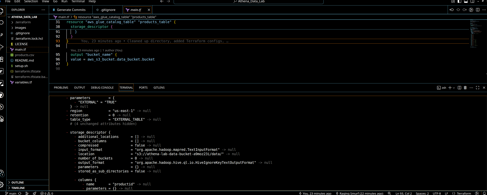
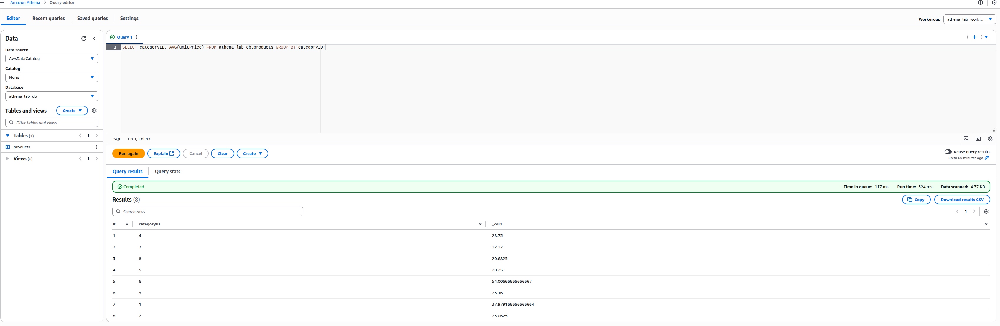
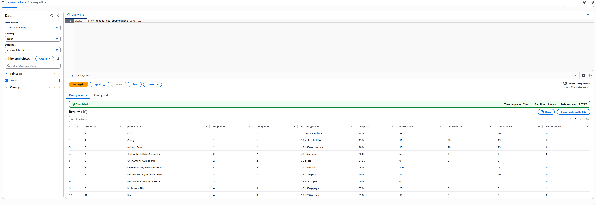

# Athena-Data-Lab
Terraform-Lab-2-Athena
A Terraform project deploying an S3 bucket, Glue DB, and Athena workgroup, populated with public product data and queried via Athena.

## Overview

This project uses Terraform to set up:

* An S3 bucket for storing public CSV data (Northwind products).
* A Glue database and table for metadata.
* An Athena workgroup for running SQL queries.Perfect for showcasing cloud data analytics skills!

## Setup

1. Clone the repo: ```git clone git@github.com:Cloud-Ops-Dev/Terraform-Lab-2-Athena.git ```
2. Ensure AWS CLI and Terraform are installed.
3. Run ```terraform init``` to initialize providers.
4. Run ```terraform apply``` to deploy resources.
5. Run ```./setup.sh``` to upload CSV data to S3.
6. Query in AWS Athena console (us-east-1, select ```athena_lab_workgroup```).

## Sample Queries
In Athena Query Editor:
```SQL
1. SELECT * FROM athena_lab_db.products LIMIT 10;
2. SELECT category, AVG(price) FROM athena_lab_db.products GROUP BY category;
 ```

## Screenshots
1. VSCodium Screen:


2. Athena Query 1:

      
3. Athena Query 2:

      

## Troubleshooting
1. Zed Woes: Zed wouldn't launch due to Vulkan surface format mismatches (B8G8R8A8_UNORM clashing with SRGB_NONLINEAR) and ERROR_INITIALIZATION_FAILED on my NVIDIA/Intel hybrid laptop. Tried driver updates (535 to 560+), env vars (GBM_BACKEND, VK_LOADER_DRIVERS_SELECT), OpenGL fallback (WGPU_BACKEND=gl), and Hyprland tweaks (windowrulev2 float for Zed). When crashes persisted (login loops on env adds), decided to pivot to VSCodium for stability.

2. AWS CLI Missing: After restoring from Zed issues, AWS CLI vanished —reinstalled v2 with curl/unzip/install script and reconfigured creds (aws configure for Access Key, Secret, us-east-1 region

3. Terraform State Empty: terraform state list showed nothing, despite files —cleared terraform and tfstate*, re-init, and applied to force deployment. Added output "bucket_name" to main.tf for setup.sh.

4. Empty Athena Queries: "Results (0)" due to schema mismatch (CSV headers like productID as string vs. table's product_id as int). - Updated main.tf Glue table columns to match CSV (productID string, added all columns, skip.header.line.count=1), reapplied, and ran MSCK REPAIR TABLE in Athena to refresh metadata.

5. General Fixes: Verified IAM perms (AmazonAthenaFullAccess, AWSGlueServiceRole, AmazonS3FullAccess), region (us-east-1), and S3 data upload via setup.sh.

# Laptop Specs & Config: 
- i7 processor, 32GB RAM, 1TB SSD
- Ubuntu 24.04 LTS, Hyprland window manager for Wayland tiling speed, 
- NVIDIA PRIME on 'nvidia' mode (for multi-monitor stability). 
- AWS CLI v2 installed for creds (aws configure) and commands like s3 ls. 
- Terraform v1.9.x for IaC.
- VSCodium Version: 1.102.24914, Electron: 35.6.0
